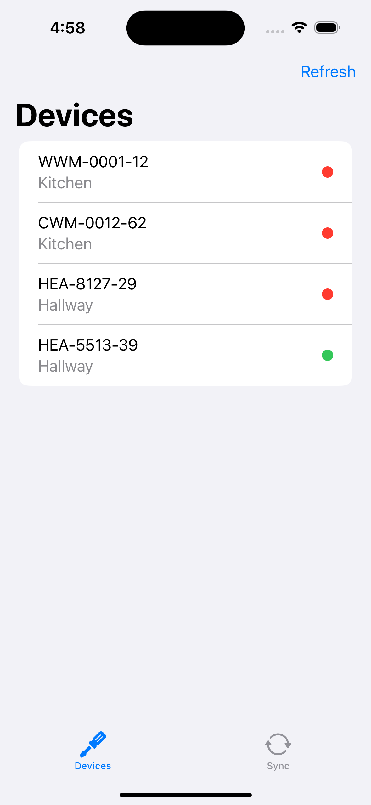
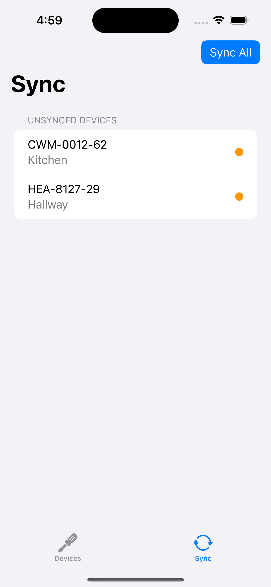

# Instructions

Hi 👋. 

Your mission, should you chose to accept it, is to is an extremely simplified version of our **installation app**.
This app is used by a grand number of our own and external field installers daily.
It helps feeding necessary information installers collect on site (apartments)
and pushes them into our system.

In this stripped down version it only sets the installation time and makes a API call to our backend.
We can't really rely on the internet connection to be always there, since we sometimes do installations
in the basement. That's why we need store all changes locally and sync all changes once we have a good
internet connection.

## The challenge

For this, you create two screens: One has a list of all devices, and one has all devices that still need to write
their installation time to the server, and a big "sync" button. If you need a third screen to set the sync date,
or if you want to integrate that into the device list is up to you. Here are three screenshots to illustrate what we mean:



.png)

The Project contains a starting point for an iOS 16 based iPhone/iPad app. However, if you want to take this to the next level
and use it as an opportunity to work with the latest beta APIs or target another one of Apples Platforms besides iOS,
then feel free to do so! As long as you show your SwiftUI skills and you have fun doing it, it's fine for us.

## The API

Of course we don't have a real server with a fake API, so we created one using an `URLProtocol` that you can use locally.
As long as you **use the included `URLSession.comgy`, instead of the shared URLSession**, no requests will actually leave your device, and the server reacts
as a real web server would do, with real https requests and real responses. Maybe a but *too real* responses…

---

## `GET https://comgy.io/devices`

This return a list of all devices on the server:

```(json)
[
    {
    "id" : "WWM-0001-12",
    "installationDate" : "2023-06-22T15:13:34Z",
    "meterPointDescription" : "Kitchen",
    "type" : "warm_water"
    }
]
```

- `id`: A unique, string based identifier. For our purposes this can also be used as the name.
- `installationDate`: The date of installation. Optional, if it is set, the device counts as "installed". Formatted in ISO8601.
- `meterPointDescription`: Required text, but does not have to be unique. Describes where the meter is installed.
- `type`: Required. One of the following values are valid: `warm_water`, `cold_water`, `heating`.

 
 ## `PATCH https://comgy.io/devices/{device-id}`

Updates the device with the supplied id on the server. The body of the request contains a JSON dictionary in the above format. Only values
that are present will be updated, but they will be validated and return errors if wrong. You can only patch one device per request,
there is no endpoint to patch multiple devices. This method returns no data, if you want the updated devices, you need to get the full list.

---

1. Pull the repo and get yourself an overview of the project
2. Try to run it and see the screens.
3. Build the app :-)

Some rules and assumptions:
- You can change anything besides the URLSession.swift that implements the server.
- Everything should be able to run locally and in the simulator. If you have any problems getting this to run or if the server behaves in ways that aren't expected, contact us!
- Explain your solution and justify your decisions in written form.
- Even though it is best practice, you don't need to write any kind of tests.
- Standard UI is good. You don't need to make it fancy, but you'd need to make it work. SwiftUI is made for quickly building interfaces, use that power!
- If you make any assumptions, let us know by writing comments in the code.
- If you use any third party frameworks, tell us why.
- You have no time limit, but we value your time and want you to do work quickly and efficiently. If you're staying in familiar waters, this should easily be doable in less than a day. However, if you decide to take this as an opportunity to get familiar with some techniques or platforms you don't usually work with, we don't want to discourage that.

We are looking forward to seeing what you come up with!

